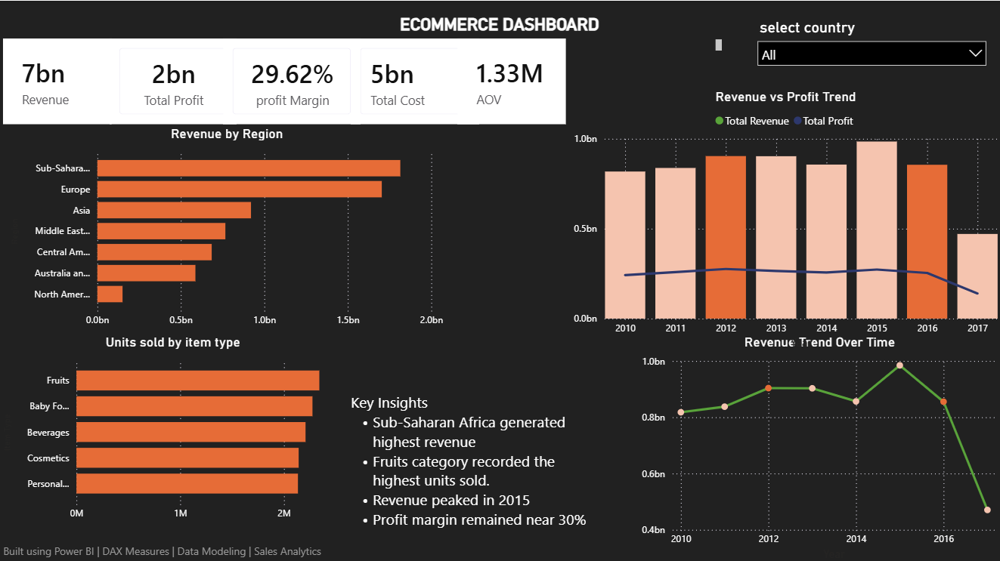

# Ecommerce Sales Analytics Dashboard

## Overview

Interactive Power BI dashboard for analyzing ecommerce sales performance across regions, products, and time periods.

## Key Metrics

* Revenue: 7B
* Profit: 2B
* Profit Margin: 29.62%
* Average Order Value (AOV): 1.33M

## Features

* Revenue by Region Analysis
* Units Sold by Item Type
* Revenue vs Profit Trend
* Revenue Trend Over Time
* Interactive Country Filter
* Business Insights

## Tools Used

* Power BI
* DAX
* Data Modeling
* Data Visualization

## Dashboard Preview

